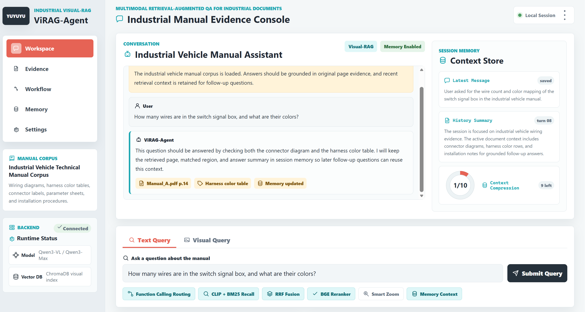
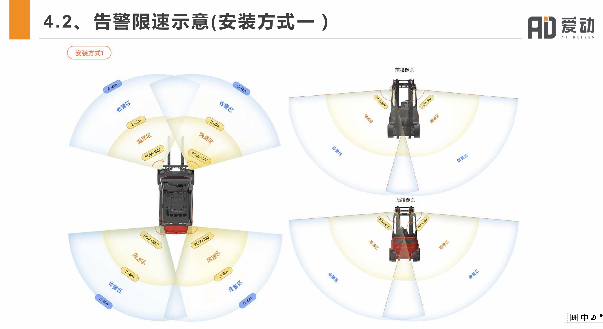
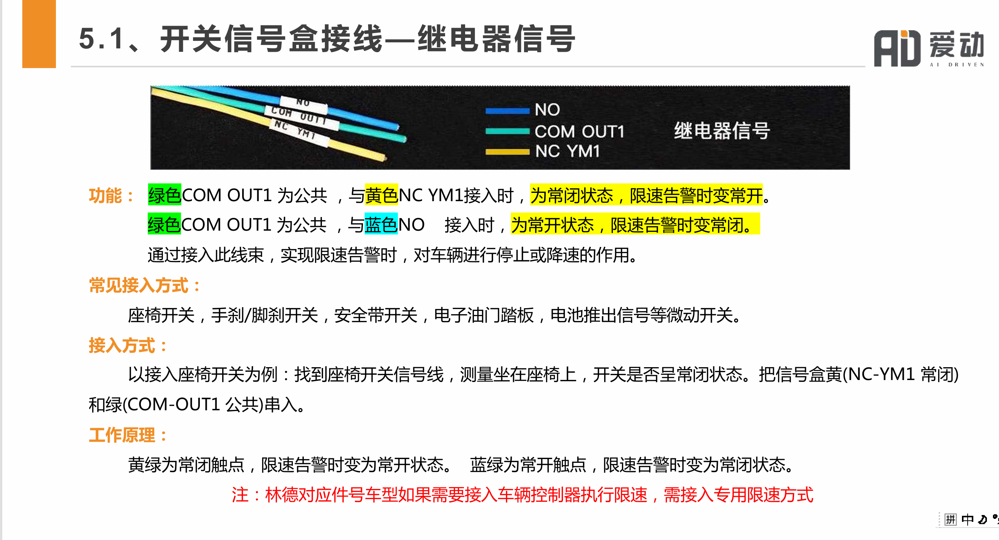

# ViRAG-Agent

**An industrial Visual-RAG system for multimodal retrieval-augmented question answering over dense vehicle manuals, wiring diagrams, and equipment documents.**



## Document Examples

| Manual Page 1 | Manual Page 2 |
| --- | --- |
|  |  |

## Tech Stack


## Table of Contents

- [ViRAG-Agent](#virag-agent)
  - [Document Examples](#document-examples)
  - [Tech Stack](#tech-stack)
  - [Table of Contents](#table-of-contents)
  - [Features](#features)
  - [Architecture](#architecture)
  - [Project Structure](#project-structure)
  - [Environment Setup](#environment-setup)
  - [Quick Start](#quick-start)
    - [1. Prepare Manuals](#1-prepare-manuals)
    - [2. Build the Visual Index](#2-build-the-visual-index)
    - [3. Run the Web Demo](#3-run-the-web-demo)
    - [4. Run CLI Mode](#4-run-cli-mode)
    - [5. Open the Static Frontend Prototype](#5-open-the-static-frontend-prototype)
  - [Example Workflow](#example-workflow)
  - [Evaluation](#evaluation)
  - [Configuration](#configuration)
  - [Use Cases](#use-cases)
  - [License](#license)

## Features

- **Visual-first manual understanding**: renders PDF pages into high-resolution images and keeps the original page image as the primary evidence source.
- **Multi-PDF ingestion**: indexes all manuals placed under `data/manual/` as one searchable industrial document corpus.
- **Hybrid retrieval**: combines CLIP visual retrieval, BM25 sparse retrieval, and reciprocal rank fusion.
- **Semantic reranking**: uses a BGE reranker to reduce false hits caused by similar diagrams, tables, and connector pages.
- **Evidence-aware VQA**: sends retrieved evidence pages to a Qwen-VL model for grounded answers with source pages.
- **Smart zoom support**: crops and enlarges local page regions for small labels, terminal IDs, knobs, and wiring details.
- **Conversation memory**: keeps recent retrieval context and conversation summaries for follow-up questions.
- **Evaluation pipeline**: supports keypoint-based judging with optional LLM fallback for retrieval and answer quality analysis.

## Architecture

```text
PDF manual(s)
  -> PyMuPDF page rendering
  -> CLIP image/text encoding
  -> ChromaDB visual index
  -> HybridRetriever (dense + BM25 + RRF)
  -> BGE Reranker
  -> EvidenceAwareVQAAgent
  -> Qwen-VL answer generation
  -> Answer + source pages
```

## Project Structure

```text
agent/
  react_agent.py              # Simple and evidence-aware VQA agents
  memory.py                   # Conversation memory
apps/
  web_demo.py                 # Gradio web interface
dataset/
  pdf_processor.py            # PDF validation, rendering, and page metadata
evaluation/
  benchmark.json              # Benchmark samples
  evaluator.py                # Rule-first + optional LLM fallback evaluator
  run_benchmark.py            # Benchmark runner
frontend/
  index.html                  # Static frontend prototype
  img/frontend_image.png      # Frontend preview screenshot
llm/
  client_factory.py           # Selects local or API VLM backend
  qwen2_vl_client.py          # Local Qwen-VL wrapper
  qwen_api_client.py          # DashScope/OpenAI-compatible API wrapper
  prompts.py                  # Prompt templates
model/
  clip_encoder.py             # CLIP encoder
retrieval/
  retriever.py                # ChromaDB visual retrieval
  hybrid_retriever.py         # ChromaDB + BM25 + RRF
  reranker.py                 # BGE reranker
scripts/
  build_vector_db.py          # Builds the visual vector database
  debug_single_image_vlm.py   # Single-image VLM debugging
tools/
  smart_zoom_tool.py          # Crop/zoom helper
config.py                     # Paths, backend settings, model names
main.py                       # Main CLI entry point
```

## Environment Setup

Python 3.9+ is recommended. A CUDA-capable GPU is recommended for local Qwen-VL inference.

```bash
pip install -r requirements.txt
```

For API-based inference:

```bash
export LLM_BACKEND=qwen_api
export DASHSCOPE_API_KEY=your_api_key
```

On Windows PowerShell:

```powershell
$env:LLM_BACKEND = "qwen_api"
$env:DASHSCOPE_API_KEY = "your_api_key"
```

For local inference, keep `LLM_BACKEND=local` and update model paths in `config.py` if needed.

## Quick Start

### 1. Prepare Manuals

Put one or more PDF manuals into:

```text
data/manual/
```

### 2. Build the Visual Index

```bash
python main.py build
```

Or run the build script directly:

```bash
python scripts/build_vector_db.py
```

To rebuild from scratch:

```bash
python scripts/build_vector_db.py --reset
```

### 3. Run the Web Demo

```bash
python main.py web
```

### 4. Run CLI Mode

```bash
python main.py cli
```

Use hybrid retrieval and reranking:

```bash
python main.py cli --hybrid
```

### 5. Open the Static Frontend Prototype

```text
frontend/index.html
```

## Example Workflow

```text
User question
  -> HybridRetriever finds candidate manual pages
  -> Reranker selects the strongest evidence page(s)
  -> EvidenceAwareVQAAgent sends page images to Qwen-VL
  -> Answer is returned with source page metadata
```

Example question:

```text
How many wires are in the switch signal box, and what are their colors?
```

## Evaluation

Run the default benchmark:

```bash
python evaluation/run_benchmark.py --benchmark evaluation/benchmark.json
```

Write results to a specific directory:

```bash
python evaluation/run_benchmark.py --benchmark evaluation/benchmark.json --output_dir evaluation/results
```

Choose a judging mode:

```bash
python evaluation/run_benchmark.py --judge_mode local_llm
python evaluation/run_benchmark.py --judge_mode rule
```

## Configuration

Important settings live in `config.py`:

- `LLM_BACKEND`: `local` or `qwen_api`
- `MANUAL_DIR`: source PDF directory
- `PAGE_IMAGES_DIR`: rendered page image directory
- `CHROMA_DB_DIR`: persistent vector database directory
- `PDF_RENDER_DPI`: page rendering DPI
- `QWEN_API_MODEL`: API model name
- `QWEN_VL_MODEL_NAME`: local Qwen-VL path or model name

## Use Cases

- Industrial vehicle installation guidance
- Maintenance and troubleshooting Q&A
- Wiring diagram and connector lookup
- Harness color and interface label interpretation
- Parameter table, specification table, and installation procedure understanding
- Source-grounded visual document evidence tracing

## License

This project is released under the MIT License. See [LICENSE](LICENSE) for details.
